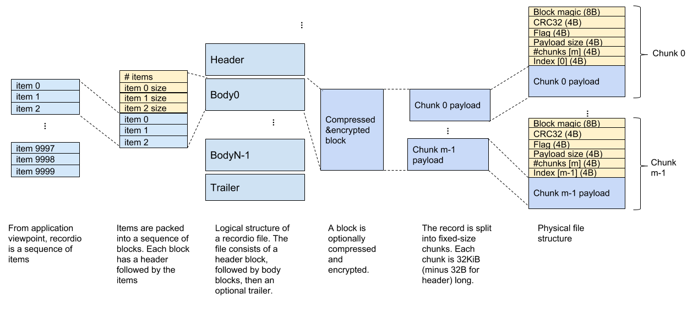

# RecordIO

A recordio file stores a sequence of _items_, with optional compression and/or
encryption.  Recordio also allows an application to generate indices.

An API documentation is available at
https://godoc.org/github.com/grailbio/base/recordio

## RecordIO file structure

The following picture shows the structure of a recordio file.

A recordio file logically stores a list of *items*. Items are grouped into
*blocks*. Each block may be compressed or encrypted, then split into sequence of
*chunks* and stored in the file.

There are three types of blocks: *header*, *body*, and *trailer*.
These block types have a common structure:

    block :=
      number of items (varint)
      item 0 size (varint)
      …
      item K-1 size (varint)
      item 0 body (bytes)
      …
      item K-1 body (bytes)

### Header block

Header block is the first block in the file. Header block contains one item. The
sole item stores a flat key-value mappings of the following form:

    header item := List of (metakey, metavalue)
    metakey := value
    metavalue := value
    value := valuetype valuebytes
    valuetype := one byte, where
        1 if the valuebytes is a utf-8 string
        2 if the valuebytes is a signed varint
        3 if the valuebytes is a unsigned varint
        4 if the valuebytes is a IEEE float64 LE
    valuebytes :=
        For utf-8, length as uvarint, followed by contents.
        For other data types, just encode the data raw.

Note: we could have defined the header as a protomessage, but we also wanted to
avoid depending on the proto library. It would complicate cross-language
integration.

The user can add arbitrary (metakey, metavalue) pairs in the header, but a few
metakey values are reserved.

Key          | Value
------------ | -------------
trailer      | Bool. Whether the file contains a trailer block
transformer  | "flate", "zstd", etc.

TODO: Reserve keys for encryption.

### Body block

Body block contains actual user data.

### Trailer block

Trailer block is optional. It contains a single arbitrary item.  Typically, it
stores an index in an application-specific format so that the application can
seek into arbitrary item if needed.

Recordio library provides a way to read the trailer block in a constant time.

## Structure of a block

At rest, a block is optionally compressed and encrypted. The resulting data is
then split into multiple _chunks_. Size of a chunk is fixed at 32KiB.  The chunk
structure allows an application to detect a corrupt chunk and skip to the next
chunk or block.

Each chunk contains a 28 byte header.

    chunk :=
        magic (8 bytes)
        CRC32 (4 bytes LE)
        flag (4bytes LE)
        chunk payload size (4 bytes LE)
        totalChunks (4 bytes LE)
        chunk index (4 bytes LE)
        flag (4 bytes LE)
        payload (bytes)

- The 8-byte magic header tells whether the chunk is part of header, body, or a trailer.

  The current recordio format defines three magic numbers: MagicHeader,
  MagicPacked, and MagicTrailer.

- The chunk payload size is (32768 - 32), unless it is for the final chunk of a
  block. For the final chunk, the "chunk payload size" stores the size of the
  block contents, and the chunk is filled with garbage to make it 32KiB at rest.

- totalChunks is the number of chunks in the block. All the chunks in the same
  block stores the same totalChunks value.

- Chunk index is 0 for the first chunk of the block, 1 for the second chunk of the block, and so on. The index resets to zero at the start of the next block.

- Flag is a 32-bit bitmap. It is not used currently.

- CRC is the IEEE CRC32 checksum of the rest of the chunk (payload size, index, flag, plus the payload).

# Compression and encryption

A block can be optionally compressed and/or encrypted using _transformers_.  The
following example demonstrates the use of flate compression.

https://github.com/grailbio/base/tree/master/recordio/example_basic_test.go

Recordio library provides a few
standard transformers:

- flate (https://github.com/grailbio/base/tree/master/recordio/recordioflate)
- zstd (https://github.com/grailbio/base/tree/master/recordio/recordiozstd)

To register zstd, for example, call

    recordiozstd.Init()

somewhere before writing or reading the recordio file. Then when writing, set
transformer "zstd" in `WriterOpts.Transformers`. The transformer name is
recorded in the recordio header block. The recordio reader reads the header,
discovers the transformer name, and automatically creates a matching reverse
transformer function.

You can also register your own transformers.  To do that, add transformer
factories when the application starts, using `RegisterTransformer`. See
recordioflate and recordiozstd source code for examples.

# Indexing

An application can arrange a callback function to be run when items are written
to storage. Such a callback can be used to build an index in a format of
application's choice.  The following example demonstrates indexing.

  https://github.com/grailbio/base/tree/master/recordio/example_indexing_test.go

The index is typically written in the trailer block of the recordio file. The
recordio scanner provides a feature to read the trailer block.

# Legacy file format

The recordio package supports a _legacy_ file format that was in use before
2018-03. recordio.Scanner supports both the current and the legacy file formats
transparently. The legacy file can still be produced using the
`deprecated/LegacyWriter` class, but we discourage its use; its support may be
completely removed in a future.

The legacy file format has the following structure:

    <header 0><record 0>
    <header 1><record 1>
    ...

Each header is:

    8 bytes: magic number
    8 bytes: 64 bit length of payload, little endian
    4 bytes: IEEE CRC32 of the length, little endian
    <record>: length bytes

The magic number is included to allow for the possibility of scanning to
the next record in the case of a corrupted file.

For the packed format each record (i.e. payload above) is as follows:

    uint32 little endian: IEEE CRC32 of all the varints that follow.
    uint32 varint: number of items in the record (n)
    uint32 varint: size of <item 0>
    uint32 varint: size of <item 1>
    ...
    uint32 varint: size of <item n>

    <item 0>
    <item 1>
    ..
    <item n>

For the simple recordio format (not packed), indexing is supported via
the Index callback which is called whenever a new record is written:

    Index func(offset, length uint64, v interface{}, p []byte) error

    offset: the absolute offset in the stream that the record is
            written at, including its header
    length: the size of the record being written, including the header.
    v:      the object marshaled if Marshal was used to write an object,
            nil otherwise
    p:      the byte slice being written

The intended use is to instantiate a new Scanner at the specified offset
in underlying file/stream.

For the packed format indexing is a more involved due to the need to
identify the start of each item as well as the record. To this end,
the Index callback is called in two ways, and a second Flush callback
is also provided.

At the start of a record:

    offset: the absolute offset, including the recordio header
    length: is the size of the entire record being written (the sum of the
            of the sizes of the items and associated metadata), including
            the recordio header.
    v:      nil
    p:      nil

For each item written to a single record:

    offset: the offset from the start of the data portion of the record
            that contains this item
    length: the size of the item
    v:      the object marshaled if Marshal was used to write an object,
            nil otherwise
    p:      the byte slice being written
